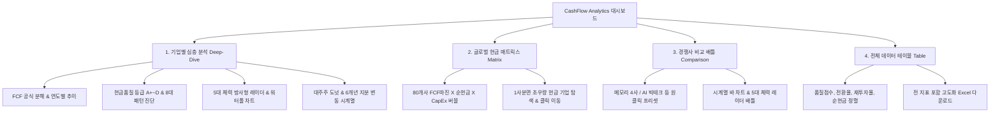

# CashFlow Analytics 📊

> **글로벌 80대 기업 6개년(2020~2025) 현금흐름(Cash Flow) & 대주주 지분 변동 시계열 대시보드**  
> 🌐 **Live Demo (GitHub Pages):** [https://eljja.github.io/CashFlow/](https://eljja.github.io/CashFlow/)  
> 📁 **GitHub Repository:** [https://github.com/eljja/CashFlow](https://github.com/eljja/CashFlow)

---

## 📌 프로젝트 소개 (Overview)

**CashFlow Analytics**는 국내, 미국, 전세계 글로벌 및 추가 혁신 기업 등 **총 80개 주요 기업**의 6개년(2020~2025) 현금흐름 데이터와 대주주 지분 구조를 기관 투자자 관점에서 시계열로 분석할 수 있는 고성능 인터랙티브 금융 웹 대시보드입니다.

- **100% 무서버(Serverless) 클라이언트 정적 구동**: 로컬 백엔드 서버 없이 **GitHub Pages(`github.io`)** 환경에서 즉시 렌더링됩니다.
- **FCF(잉여현금흐름) 중심의 1위 핵심 지표 설계**: 본업 현금창출력(OCF)에서 미래 설비투자(CapEx)를 차감한 실질적 잉여현금 및 순현금 완충력을 집중 조명합니다.
- **현금 건전성 품질 등급(A+~D) 및 8대 아키타입 진단**: 회계상 순이익의 실제 현금화 비율, 재투자율, 부채 완충력을 종합 평가합니다.
- **5대 현금 체력 방사형 레이더 (Radar Chart)**: FCF 창출력, 순현금 안전성, 현금 전환율, 주주환원 적극성, 투자 효율성을 다각형으로 시각화합니다.
- **글로벌 현금 매트릭스 지형도 (Scatter / Bubble Plot)**: 80개 기업의 FCF 마진율(X축)과 순현금(Y축), 설비투자 규모(버블 크기)를 한눈에 파악합니다.
- **경쟁사 원클릭 비교 배틀 (Peer Battle)**: 메모리 4사(삼성전자 vs SK하이닉스 vs 마이크론 vs 키옥시아), AI 빅테크(엔비디아 vs MS vs 구글 vs 메타 vs 애플) 등 다중 기업 직접 비교.
- **실시간 통화 변환 & 엑셀 다운로드**: USD($), KRW(₩), 원천 통화 간 실시간 환산 및 전 지표 `.xlsx` 다운로드를 지원합니다.

---

## 🧭 4대 핵심 화면 및 분석 기능



### 1. 기업별 심층 분석 (Company Deep-Dive)
- **FCF 창출 공식 분석기**: $\text{FCF} = \text{영업활동현금흐름(OCF)} - \text{설비투자(CapEx)}$ 계산식을 실제 금액과 함께 실시간 도출
- **현금흐름 품질 평가 & 8대 패턴 진단 (`CashQualityBadge`)**:
  - `A+`, `A`, `B`, `C`, `D` 등급 및 100점 만점 종합 점수 산출
  - `🏆 우량 초우량형`, `🚀 고성장 투자확대형`, `🔄 자산회수형`, `🌱 초기 유망형` 등 8대 패턴 자동 판정 및 해설
  - 4대 고급 비율: FCF 전환율(%), CapEx 재투자율(%), 순현금 완충비율(%), 주주환원 배분율(%)
- **차트 뷰 모드 전환**: `시계열 콤보 차트` ↔ `현금 창출 워터폴 구조(Waterfall)` 원클릭 토글
- **5대 현금 체력 방사형 레이더 (`CashRadarChart`)**: 5차원 다각형 현금 건전성 시각화
- **대주주 구성 및 6개년 지분 변동 (`ShareholderChart`)**:
  - 사모펀드(베인캐피탈, 버크셔 해서웨이), 글로벌 자산운용사(블랙록, 뱅가드), 연기금(국민연금, 사우디PIF), 창업자/특수관계인의 2020~2025년 지분율 변화 추이

### 2. 글로벌 현금 매트릭스 지형도 (Global Cash Matrix)
- **X축**: FCF 마진율 (%) - 수익성 및 현금 창출 효율
- **Y축**: 순현금 보유고 ($B USD 기준 정규화) - 재무적 완충력 및 부채 안전성
- **버블 크기**: 연간 설비투자(CapEx 규모)
- **인터랙티브 탐색**: 1사분면(우상향) 초우량 기업 확인 및 버블 클릭 시 해당 기업 심층 분석으로 즉시 이동

### 3. 경쟁사 비교 배틀 (Peer Comparison & Radar Battle)
- **원클릭 추천 배틀 프리셋**:
  - 🔥 **메모리 4사 대전**: **삼성전자 vs SK하이닉스 vs 마이크론 vs 키옥시아**
  - 🤖 **AI 빅테크**: **엔비디아 vs 마이크로소프트 vs 알파벳 vs 메타 vs 애플**
  - ⚡ **글로벌 파운드리/반도체**: **TSMC vs 인텔 vs 삼성전자 vs ASML**
  - 🚗 **글로벌 모빌리티**: **현대차 vs 기아 vs 테슬라 vs 도요타 vs BYD**
  - 💎 **럭셔리 하이엔드**: **LVMH vs 에르메스 vs 페라리**
  - ☁️ **클라우드/AI SW**: **팔란티어 vs 스노우플레이크 vs 세일즈포스 vs 어도비**
- **비교 모드**: `시계열 막대 비교` 및 `5대 체력 레이더 배틀 (다중 오버레이)` 지원

### 4. 전체 데이터 수치표 (Data Table & Excel Export)
- 80개 기업의 모든 지표를 컬럼별로 오름차순/내림차순 정렬 및 실시간 검색
- 2020년부터 2025년까지의 연도별 데이터 전환 지원
- 현금품질 등급, 현금 패턴, FCF 전환율, 재투자율, 순현금 등이 포함된 **Excel (`.xlsx`) 원클릭 다운로드**

---

## 🏢 분석 대상 기업 풀 (총 80개사)

| 카테고리 (20개사씩) | 주요 수록 기업 목록 |
| :--- | :--- |
| **1. 국내 대표 20 (Domestic)** | **삼성전자**, **SK하이닉스**, LG에너지솔루션, 현대자동차, 기아, NAVER, 카카오, POSCO홀딩스, 삼성바이오로직스, 셀트리온, LG화학, 삼성SDI, KB금융, 신한지주, 한화에어로스페이스, HD현대중공업, 크래프톤, SK이노베이션, KT&G, 두산에너빌리티 |
| **2. 미국 대표 20 (US)** | **엔비디아 (NVIDIA)**, **마이크론 (Micron)**, **인텔 (Intel)**, 애플 (Apple), 마이크로소프트 (Microsoft), 알파벳 (Google), 아마존 (Amazon), 메타 (Meta), 테슬라 (Tesla), AMD, 퀄컴 (Qualcomm), 브로드컴 (Broadcom), 버크셔 해서웨이 (Berkshire Hathaway), JP모건 체이스 (JPMorgan), 엑슨모빌 (ExxonMobil), 존슨앤존슨 (J&J), 일라이 릴리 (Eli Lilly), 월마트 (Walmart), 넷플릭스 (Netflix), 오라클 (Oracle) |
| **3. 글로벌 대표 20 (Global)** | **키옥시아 (Kioxia - 일본/베인캐피탈)**, TSMC, ASML, 도쿄일렉트론 (Tokyo Electron), 도요타 (Toyota), 소니 (Sony), LVMH (루이비통), 노보 노디스크 (Novo Nordisk), SAP, 아스트라제네카 (AstraZeneca), 에르메스 (Hermes), 소프트뱅크그룹 (SoftBank), 텐센트 (Tencent), 알리바바 (Alibaba), BYD (비야디), 셸 (Shell), 토탈에너지스 (TotalEnergies), 네슬레 (Nestle), 로슈 (Roche), ARM Holdings |
| **4. 추가 유망/혁신 20 (Additional)** | 팔란티어 (Palantir), 스노우플레이크 (Snowflake), 크라우드스트라이크 (CrowdStrike), 세일즈포스 (Salesforce), 어도비 (Adobe), 어플라이드 머티어리얼즈 (AMAT), 램리서치 (Lam Research), 시스코 (Cisco), 우버 (Uber), 에어비앤비 (Airbnb), 스포티파이 (Spotify), 코인베이스 (Coinbase), 블록 (Block), 메르카도리브레 (MELI), 씨 (Sea Limited), 닌텐도 (Nintendo), 혼다 (Honda), 에어버스 (Airbus), 페라리 (Ferrari), 리오틴토 (Rio Tinto) |

---

## 📈 수록 재무 및 현금 심층 지표 체계

- **영업활동 현금흐름 (Operating Cash Flow, OCF)**: 본업 현금 창출력
- **자본적 지출 (Capital Expenditure, CapEx)**: 설비 및 공장 투자 규모
- **잉여현금흐름 (Free Cash Flow, FCF = OCF - CapEx)**: 기업에 최종 귀속되는 순수 잉여현금
- **FCF 마진 (FCF Margin = FCF / Revenue %)**: 매출액 대비 잉여현금 창출 마진율
- **FCF 전환율 (Cash Conversion Rate = FCF / Net Income %)**: 당기순이익의 실질 현금화 비율
- **CapEx 재투자율 (Reinvestment Rate = CapEx / OCF %)**: 영업현금 중 미래 투자 투입 비율
- **재무활동 현금흐름 (Financing Cash Flow)**: 차입, 상환, 배당 등 재무적 흐름
- **현금 배당금 지급액 (Dividends Paid)** & **자사주 매입/소각액 (Share Buybacks)**: 총 주주환원액
- **기말 현금 및 단기금융상품 (Cash & Short-Term Investments)**: 총 가용현금 보유고
- **총차입금 (Total Debt)** 및 **순현금 (Net Cash = Total Cash - Total Debt)**: 재무적 안전 완충력
- **대주주 구성 및 6개년 지분 변동**: 사모펀드(베인캐피탈, 버크셔), 자산운용사(블랙록, 뱅가드), 연기금(국민연금, 사우디PIF), 창업자 지분

---

## 🔄 데이터 갱신 및 1개월 주기 관리 시스템

- **데이터 갱신일 자동 기록**: 데이터 파이프라인 빌드 시점의 타임스탬프(`lastUpdated`)가 메타데이터에 자동 반영됩니다.
- **1개월(30일) 주기 상태 판정**:
  - `🟢 정상 최신 상태`: 마지막 갱신일로부터 30일 이내 (잔여 일수 표시)
  - `🟡 업데이트 권장`: 마지막 갱신일로부터 30일 초과 시 알림 및 GitHub Actions 즉시 갱신 버튼 제공
- **주간 정기 자동 갱신 크론**: `.github/workflows/deploy.yml`을 통해 매주 월요일 자정 자동 데이터 갱신 및 재배포 수행

---

## 🔍 구글 검색 최적화 (SEO) 및 소유권 확인

- **Google Search Console 메타 태그**: `google-site-verification` 태그 탑재 완료
- **사이트맵 및 크롤러 설정**:
  - `sitemap.xml`: [https://eljja.github.io/CashFlow/sitemap.xml](https://eljja.github.io/CashFlow/sitemap.xml)
  - `robots.txt`: [https://eljja.github.io/CashFlow/robots.txt](https://eljja.github.io/CashFlow/robots.txt)
- **Schema.org JSON-LD 구조화 데이터**: 구글 리치 결과(Rich Results) 및 지식 그래프 최적화

---

## 🚀 GitHub Pages 배포 안내

본 리포지토리는 GitHub Actions 자동 배포 워크플로우(`.github/workflows/deploy.yml`)와 `gh-pages` 브랜치 이중 배포 체계로 구성되어 있습니다.

1. GitHub 저장소의 **`Settings > Pages`** 로 이동합니다.
2. **Build and deployment > Source** 옵션에서 **`GitHub Actions`** 를 선택합니다.
3. `main` 브랜치에 코드가 푸시되면 자동으로 빌드되어 **`https://eljja.github.io/CashFlow/`** 에 배포됩니다.

---

## 🛠️ 기술 스택 & 로컬 개발 환경

### Tech Stack
- **Frontend**: React 18, TypeScript, Vite 6, Tailwind CSS
- **Data Visualization**: Apache ECharts (`echarts-for-react`)
- **Icons & UI Utilities**: Lucide React, clsx, tailwind-merge
- **Data Export**: SheetJS (`xlsx`)
- **Data Pipeline**: Python 3.11

### Commands
```bash
# 의존성 패키지 설치
npm install

# 80개사 6개년 데이터셋 생성/갱신
python scripts/generate_all.py

# 로컬 개발 서버 실행
npm run dev

# 프로덕션 번들 빌드
npm run build

# 빌드 결과물 미리보기
npm run preview
```

---

## 📄 License

MIT License © 2026 CashFlow Analytics
